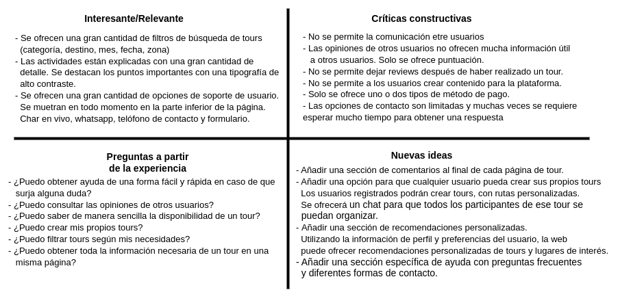
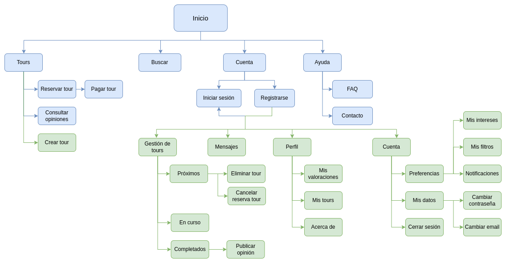

## DIU - Practica2, entregables

### Ideación (Malla receptora de información)

>>> Se ha realizado una malla receptora de la aplicación web freetour (https://freetour-granada.com/). Tras analizar la malla receptora se ha decidido realizar una aplicación con una mayor personalización. El usuario ahora va a poder tener un usuario con el que interactuar con otros usuarios de la aplicación. También el usuario podrá crear contenido en la plataforma, pudiendo organizar sus propias actividades, unirse a actividades creadas por otros usuarios, etc..
>>>
>>> También se le ha dado importancia a la función de búsqueda, teniendo un apartado en la cabecera y a la funcionalidad de recomendación de tours, basado en previas experiencias del usuario.

### PROPUESTA DE VALOR (ScopeCanvas)

>>> MyTourExplorer se trata de una aplicación web donde los usuarios van a poder organizar y apuntarse a tours. Estos tours van a estar organizados por los propios usuarios o por la misma empresa. Estos tours podrán ser gratuitos o de pago. La empresa en este último caso se llevaría una comisión por cada usuario que se apunte a un evento. Los usuarios podrán registrarse y así poder obtener recomendaciones personalizada y acceder a funciones como chat de tour, crear tours, crear filtros, etc... Estos podrán crear eventos y comunicarse entre ellos mediante un chat. Cuando hayan finalizado una actividad, los usuarios podrán dejar una valoración ya sea, al organizador del tour y al tour en sí.

### TASK ANALYSIS (User task  matrix)

>>> En este apartado se ha decidido realizar una User Task Matrix ya que es una aplicación que puede ser por más de un tipo de usuario. Se encuentran los usuarios invitados (Sin iniciar sesión), los cuales puedes realizar una serie de funciones limitadas en la aplicación. En caso de que inicien sesión, las acciones que realizarán serán otras y tendrán una importancia distinta.
>>>
>>> Se ha clasificado la importancia de las acciones en tres apartados (Alta, Media o Baja). En caso de que un tipo de usuario no pueda realizar una acción se ha dejado un `-`

### ARQUITECTURA DE INFORMACIÓN

* Sitemap 

>>> Sitemap con la estructura de la web. Algunas funcionalidades solo se pueden acceder si se inicia sesión en la aplicación.

* Labelling

>>> Explicación de cada uno de los elementos del sitemap.

### Prototipo Lo-FI Wireframe 

0. Página de inicio. Es primero que el usuario ve al introducir la url de la web. Se muestran los tours próximos en forma de carrusel. Al hacer click en el título del tour o la foto/vídeo se redirige al usuario a la página del tour (Frame 7)
1. Página de pago de un tour. En el caso de que el usuario no tenga la sesión iniciada se le pedirán datos de contacto como nombre, email, dirección y teléfono. En ambos casos se pedirá datos de pago. Se ofrecen múltiples opciones de pago (Tarjeta, Paypal, Bizum o efectivo).
2. Frame 1 con sesión iniciada
3. En caso de que el pago se haya de manera correcta se mostrará una imagen con la foto de portada del tour, junto a un texto indicando que el pago se ha realizado de manera correcta. En el caso de usuario invitado, al darle al botón se volverá a la página del tour. En caso de usuario registrado se le redirigirá a la página de tours del usuario (Frame 15)
4. Registro.
5. Inicio de sesión.
6. Página para explorar tours. Se agrupan por categorías. Cada categoría tendrá un título y un carrusel con tours. La primera de las categorías serán tours recomendados al usuario basado en las preferencias de este (Añadidas frame 18). Cada ítem contendrá foto principal del tour, título del tour y su precio en la parte superior derecha.
7. Página principal del tour. Se muestra título del tour junto a foto/vídeo. Debajo del título se mostrará una breve descripción del tour y un botón de reserva. Justo después, imágenes extra relacionadas con el tour. A continuación se mostrarán una seria indefinida de bloques donde se describe el tour con más profundidad. También se mostrará un mapa con la ruta a seguir. Justo después se mostrará una lista de normas y puntos clave sobre el tour. Por último, en caso de que ese mismo tour se haya realizado anteriormente, se mostrarán opiniones de otros usuarios.
8. Página de creación de un tour. Se pedirán todos los datos mostrados en el frame 7. Se podrán añadir tantas secciones como el creador quiera, al igual que puntos clave.
9. Página de búsqueda de tours. Se podrán aplicar filtros al momento o usar filtros previamente guardados. Para ello se deberá hacer click en el icono en la parte superior derecha de la barra de búsqueda. Se mostrará una ventana emergente con los filtros guardados. En el caso de querer editar o añadir más filtros se tiene el botón en forma de texto de "Administrar filtros"
10. Página donde se muestran los resultados de la búsqueda del frame 9. Se mantendrá el menú de búsqueda del frame anterior y se mostrará una lista con los tours.
11. Chat con los tours de los que el usuario es partícipe. En la parte izquierda se mostrarán la lista de tours en el que el usuario participa. Una vez clickado en un chat, este se mostrará en la parte derecha de la pantalla. Los mensajes del usuario se muestran en la parte derecha, los de otros usuarios, en la izquierda.
12. Perfil público de un usuario. Se pueden ver los tours en lo que ha participado. Las valoraciones que este ha recibido y las que ha dado a otros usuarios e información personal como biografía o correo electrónico. Se muestra información básica como foto de perfil, nombre y la lista de tours.
13. Igual que el frame 12, solo que ahora se muestran opiniones recibidas y dadas al usuario. Cada opinión tiene título, descripción y puntuación del 1 al 5.
14. Igual que el frame 12, solo que ahora se muestra información del usuario como biografía, email, zona en la que vive, etc...
15. Tours del usuario. Futuros tours, en curso y completados. En el último caso, se mostrará un icono para dejar una valoración.
16. Tours completados. El usuario crea una opinión la cual contiene título, descripción y una puntuación en forma de estrellas del 1 al 5.
17. Página con las opciones de la cuenta del usuario. Preferencias, cuentas y cerrar sesión.
18. Página con las preferencias del usuario. Estas incluyen intereses, filtros y notificaciones. En el primer apartado se encuentran los filtros. Si se hace click en botón de gestionar se muestra la ventana emergente donde se muestra la lista de filtros y pueden borrar. Para añadir uno, se deberán rellenar los desplegables y hacer click en añadir. En el caso de los intereses, se selecciona un item del desplegable y se hace click en añadir. Se mostrará el interés en la parte superior del desplegable, donde se puede borrar el interés haciendo click en la "x". Debajo de los intereses se mostrarán ajustes de la cuenta como por ejemplo, configuración de envío de mails, perfil público o privado, etc..
19. Ajustes de cuenta. Página donde se pueden consultar y modificar los datos personales del usuario.
20. Página con la ayuda. Hay un FAQ con preguntas y respuestas frecuentes y al final un formulario de contacto. La FAQ se muentra en formato de desplegables, al principio solo se muestra la pregunta, al hacer click se mostrará la respuesta. Al final, un formulario de contacto.

>>> Prototipo de la aplicación
[Link a figma](https://www.figma.com/file/hRuAQ1bHABRlx06cwA4xNI/Wireframe?node-id=0%3A1&t=snqoiEzs2HDrXBtY-1)

[Wireframe PDF](Wireframe.pdf)

### Conclusiones  
(incluye valoración de esta etapa)
