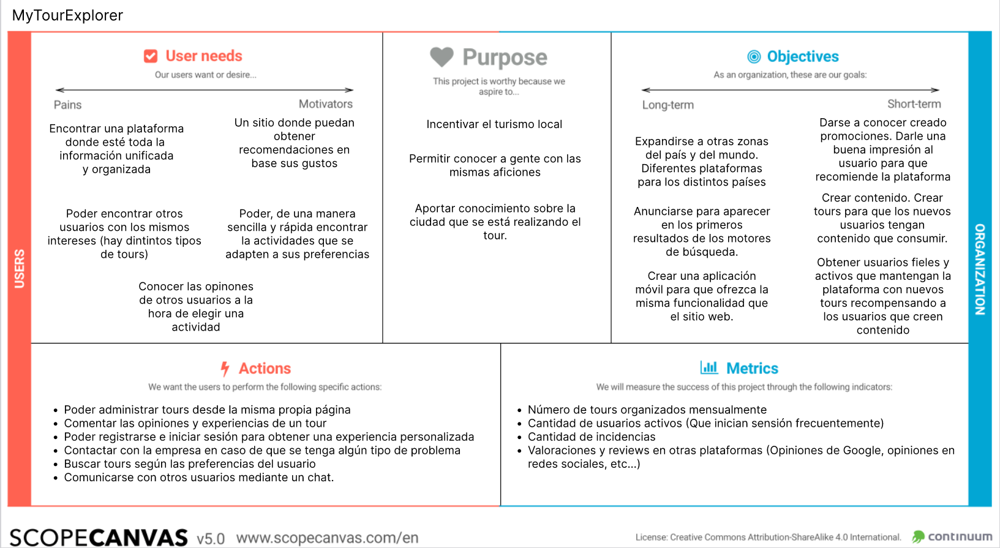

## DIU - Practica2, entregables

### Ideación (Malla receptora de información)

>>> Se ha realizado una malla receptora de la aplicación web freetour (https://freetour-granada.com/). Tras analizar la malla receptora se ha decidido realizar una aplicación con una mayor personalización. El usuario ahora va a poder tener un usuario con el que interactuar con otros usuarios de la aplicación. También el usuario podrá crear contenido en la plataforma, pudiendo organizar sus propias actividades, unirse a actividades creadas por otros usuarios, etc..
>>>
>>> También se le ha dado importancia a la función de búsqueda, teniendo un apartado en la cabecera y a la funcionalidad de recomendación de tours, basado en previas experiencias del usuario.

### PROPUESTA DE VALOR (ScopeCanvas)

>>> Se trata de una aplicación web donde los usuarios van a poder organizar y apuntarse a tours. Estos tours van a estar organizados por los propios usuarios o por la misma empresa. Estos tours podrán ser gratuitos o de pago. La empresa en este último caso se llevaría una comisión por cada usuario que se apunte a un evento. Los ususarios podrán registrarse y así obtener una experiencia personalizada. Estos podrán crear eventos y comunicarse entre ellos mediante un chat. Cuando hayan finalizado una actividad, estos podrán dejar una valoración.

### TASK ANALYSIS (User task  matrix)

>>> En este apartado se ha decidido realizar una User Task Matrix ya que es una aplicación que puede ser por más de un tipo de usuario. Se encuentran los usuarios invitados (Sin iniciar sesión), los cuales puedes realizar una serie de funciones limitadas en la aplicación. En caso de que inicien sesión, las acciones que realizarán serán otras y tendran una importancia distinta.
>>>
>>> Se ha clasificado la importancia de las acciones en tres apartados (Alta, Media o Baja). En caso de que un tipo de usuario no pueda realizar una acción se ha dejado un `-`

### ARQUITECTURA DE INFORMACIÓN

* Sitemap 

>>> Sitemap con la estructura de la web. Algunas funcionalidades solo se pueden acceder si se inicia sesión en la aplicación.

* Labelling

>>> Explicación de cada uno de los elementos del sitemap.

### Prototipo Lo-FI Wireframe 

>>> Prototipo de la aplicación

[Link a figma](https://www.figma.com/file/hRuAQ1bHABRlx06cwA4xNI/Wireframe?node-id=0%3A1&t=snqoiEzs2HDrXBtY-1)

### Conclusiones  
(incluye valoración de esta etapa)
