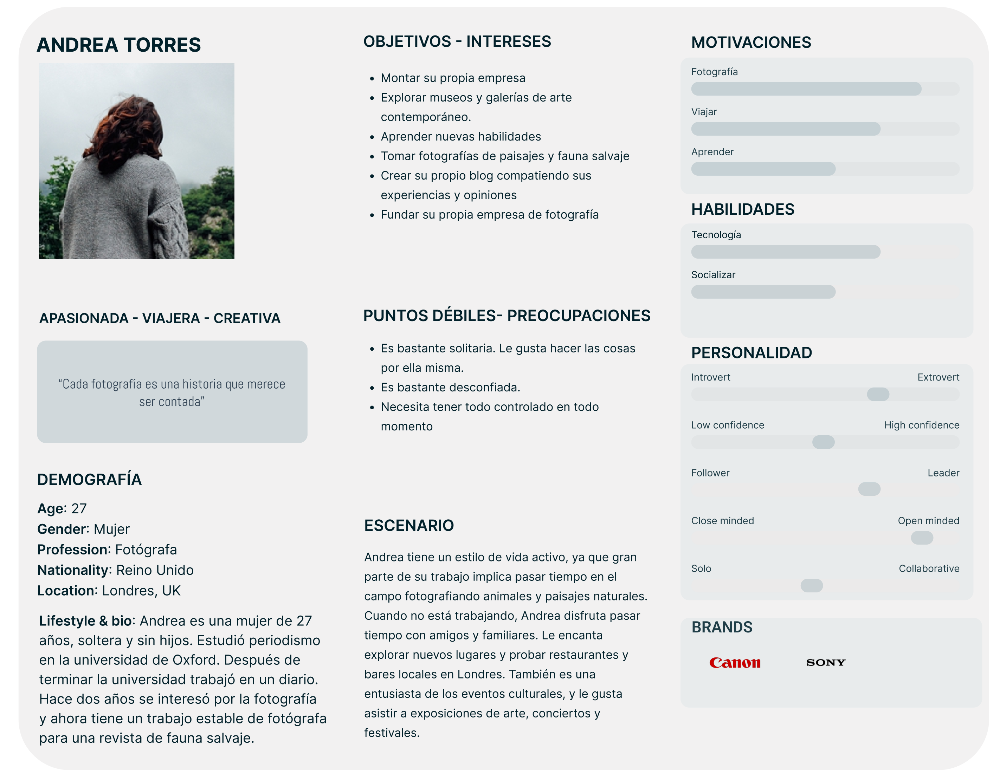
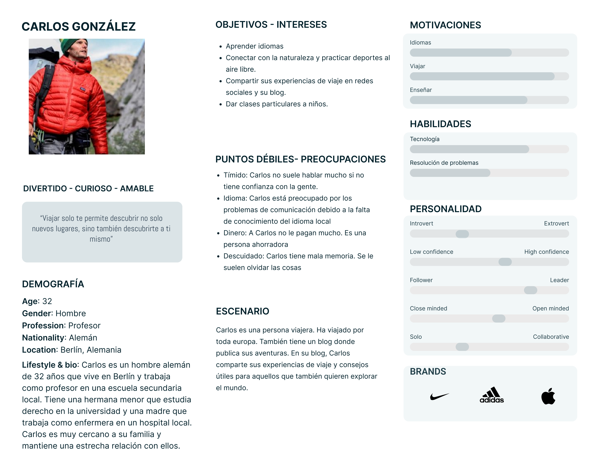
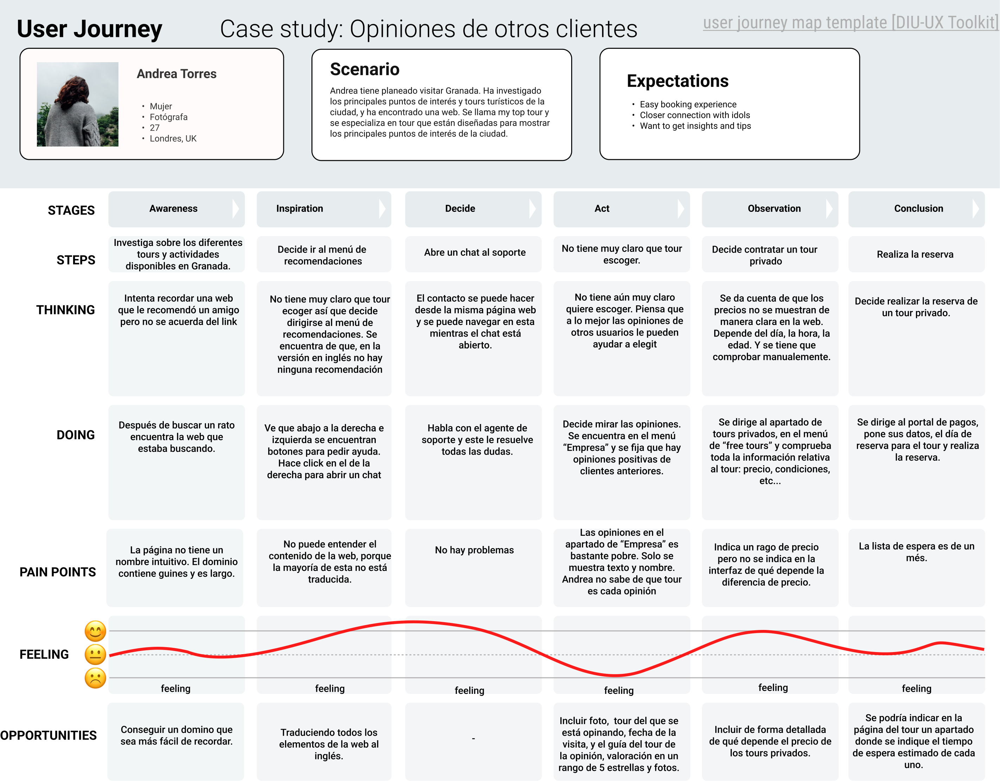
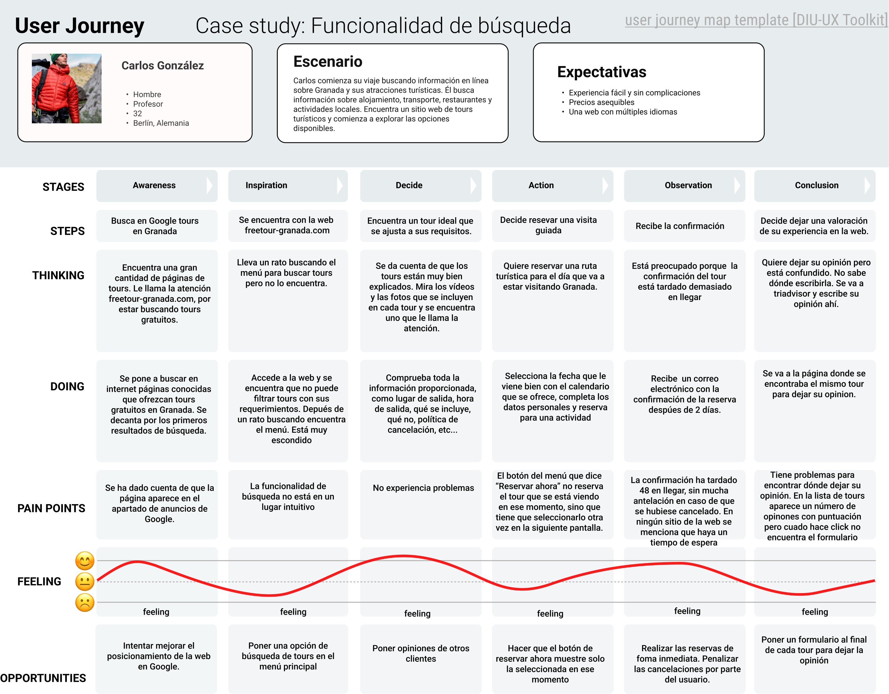
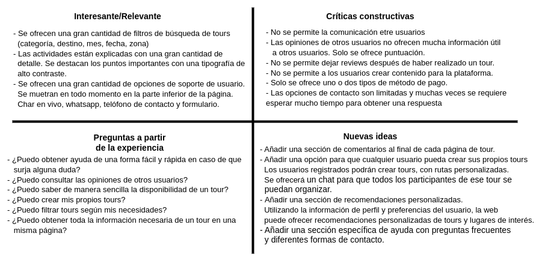
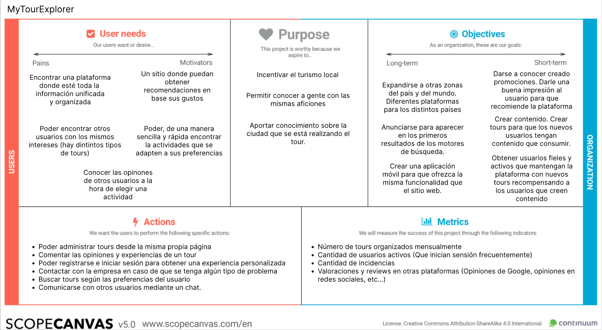
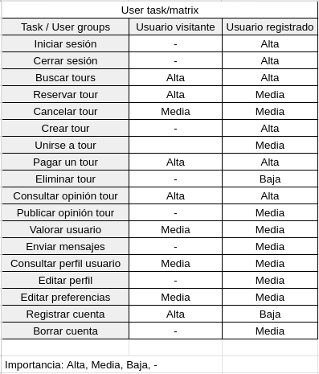
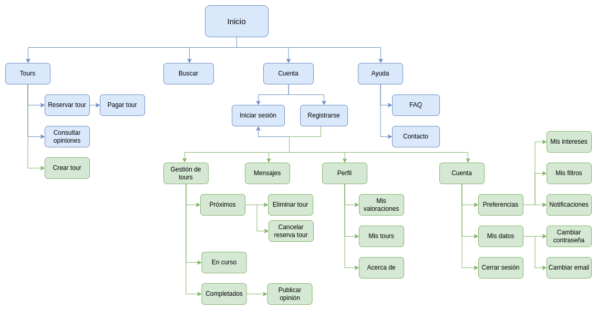
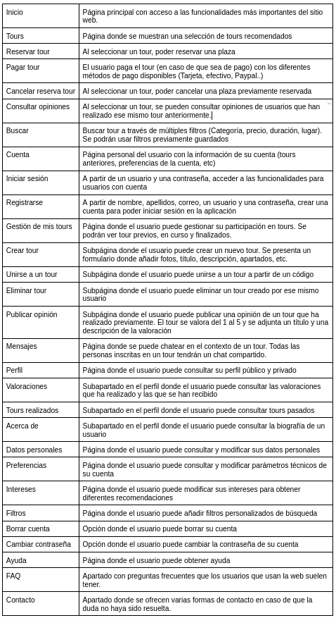
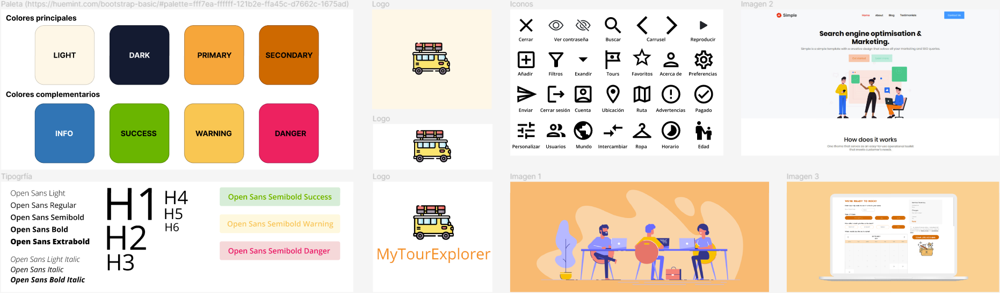

# DIU23
Prácticas Diseño Interfaces de Usuario 2022-23 (Tema: Free Tour ) 

> **Grupo:** DIU2_Polaco.  Curso: 2022/23 

> **Proyecto:** MyTourExplorer

> **Descripción:** MyTourExplorer es una aplicación web que permite a los usuarios organizar y unirse a tours, tanto gratuitos como de pago. Los usuarios pueden registrarse, obtener recomendaciones personalizadas, chatear, crear filtros y dejar valoraciones.

> Miembros
> * :bust_in_silhouette:   Ismael Melchor Juan     :octocat:     

----- 

# Proceso de Diseño 

## Paso 1. UX Desk Research & Analisis 

###  1.a Competitive Analysis

> Se realizó un análisis competitivo utilizando como caso base la web https://freetour-granada.com/. Los competidores directos son Expedia y Viator, que ofrecen una amplia selección de tours y actividades en todo el mundo, plataformas fáciles de usar con opciones de búsqueda y filtrado avanzadas, ofertas y descuentos, reseñas y calificaciones de clientes. Sus debilidades son la calidad variable de tours y actividades, precios más altos que los competidores indirectos, opciones de personalización limitadas. Los competidores indirectos son agencias de viajes tradicionales y guías locales que ofrecen servicios personalizados, conexiones y relaciones locales, y precios competitivos, pero pueden tener dificultades en la reserva y pago en línea, opciones de búsqueda limitadas, y calidad variable en tours y actividades.

[Competivive Analisys PDF](img/ismael/Competitor-Analysis.pdf ':ignore')

###  1.b Persona

Se han creado dos personas con gustos y características distintas:

> Andrea es una fotógrafa que busca capturar imágenes de lugares y monumentos. Esto la convierte en una buena representante de los usuarios interesados en la fotografía
    

> Carlos, por otro lado,  es una persona aventurera y curiosa que disfruta de viajar y explorar nuevos lugares, lo que lo convierte en un buen representante de los usuarios interesados en la cultura y la aventura.

###  1.c User Journey Map

> En el experience journey map se han propuesto dos interacciones hipotéticas, intentando ser lo más realistas posibles. En primer lugar, Carlos tiene poco presupuesto y busca tour gratuitos. Es alemán, por lo que no sabe ni inglés ni español. Tiene que recurrir a traductores externos. En el caso de Andrea, ella es fotógrafa y no sabe español tampoco pero sí inglés. Se da cuenta de que la mayor parte de la página no está traducida. Tampoco puede encontrar cómo opinar después de haber realizado el tour.

###  1.d Usability Review

> La página web ha obtenido una puntuación de 73 en el Usability review. En general la página tiene un buen diseño. Sin embargo, fallos como menús poco claros, una página que está parcialmente traducida al inglés y, por lo tanto, cuando se selecciona el idioma de inglés, la mayoría del contenido sigue en Español o una funcionalidad de búsqueda que cuesta encontrarla hacen que, una experiencia que podría haber sido muy positiva para el usuario, sea solo aceptable.

[Usability review](img/ismael/Usability-review.pdf  ':ignore')

## Paso 2. UX Design  

###  2.a Feedback Capture Grid / EMpathy map / POV

> Se ha realizado una malla receptora de la aplicación web freetour (https://freetour-granada.com/). Tras analizar la malla receptora se ha decidido realizar una aplicación con una mayor personalización. El usuario ahora va a poder tener un usuario con el que interactuar con otros usuarios de la aplicación. También el usuario podrá crear contenido en la plataforma, pudiendo organizar sus propias actividades, unirse a actividades creadas por otros usuarios, etc..

> También se le ha dado importancia a la función de búsqueda, teniendo un apartado en la cabecera y a la funcionalidad de recomendación de tours, basado en previas experiencias del usuario.

###  2.b ScopeCanvas

> MyTourExplorer es una aplicación web donde los usuarios van a poder organizar y apuntarse a tours. Estos tours van a estar organizados por los propios usuarios o por la misma empresa. Estos tours podrán ser gratuitos o de pago. La empresa en este último caso se llevaría una comisión por cada usuario que se apunte a un evento. Los usuarios podrán registrarse y así poder obtener recomendaciones personalizada y acceder a funciones como chat de tour, crear tours, crear filtros, etc... Estos podrán crear eventos y comunicarse entre ellos mediante un chat. Cuando hayan finalizado una actividad, los usuarios podrán dejar una valoración ya sea, al organizador del tour y al tour en sí.

###  2.b Tasks analysis 

> Se ha decidido realizar una User Task Matrix ya que es una aplicación que puede ser por más de un tipo de usuario. Se encuentran los usuarios invitados (Sin iniciar sesión), los cuales puedes realizar una serie de funciones limitadas en la aplicación. En caso de que inicien sesión, las acciones que realizarán serán otras y tendrán una importancia distinta.

> Se ha clasificado la importancia de las acciones en tres apartados (Alta, Media o Baja). En caso de que un tipo de usuario no pueda realizar una acción se ha dejado un `-`

###  2.c IA: Sitemap + Labelling 

Sitemap con la estructura de la web. Algunas funcionalidades solo se pueden acceder si se inicia sesión en la aplicación.

Labelling

###  2.d Wireframes

0. Página de inicio. Es primero que el usuario ve al introducir la url de la web. Se muestran los tours próximos en forma de carrusel. Al hacer click en el título del tour o la foto/vídeo se redirige al usuario a la página del tour (Frame 7)
1. Página de pago de un tour. En el caso de que el usuario no tenga la sesión iniciada se le pedirán datos de contacto como nombre, email, dirección y teléfono. En ambos casos se pedirá datos de pago. Se ofrecen múltiples opciones de pago (Tarjeta, Paypal, Bizum o efectivo).
2. Frame 1 con sesión iniciada
3. En caso de que el pago se haya de manera correcta se mostrará una imagen con la foto de portada del tour, junto a un texto indicando que el pago se ha realizado de manera correcta. En el caso de usuario invitado, al darle al botón se volverá a la página del tour. En caso de usuario registrado se le redirigirá a la página de tours del usuario (Frame 15)
4. Registro.
5. Inicio de sesión.
6. Página para explorar tours. Se agrupan por categorías. Cada categoría tendrá un título y un carrusel con tours. La primera de las categorías serán tours recomendados al usuario basado en las preferencias de este (Añadidas frame 18). Cada ítem contendrá foto principal del tour, título del tour y su precio en la parte superior derecha.
7. Página principal del tour. Se muestra título del tour junto a foto/vídeo. Debajo del título se mostrará una breve descripción del tour y un botón de reserva. Justo después, imágenes extra relacionadas con el tour. A continuación se mostrarán una seria indefinida de bloques donde se describe el tour con más profundidad. También se mostrará un mapa con la ruta a seguir. Justo después se mostrará una lista de normas y puntos clave sobre el tour. Por último, en caso de que ese mismo tour se haya realizado anteriormente, se mostrarán opiniones de otros usuarios.
8. Página de creación de un tour. Se pedirán todos los datos mostrados en el frame 7. Se podrán añadir tantas secciones como el creador quiera, al igual que puntos clave.
9. Página de búsqueda de tours. Se podrán aplicar filtros al momento o usar filtros previamente guardados. Para ello se deberá hacer click en el icono en la parte superior derecha de la barra de búsqueda. Se mostrará una ventana emergente con los filtros guardados. En el caso de querer editar o añadir más filtros se tiene el botón en forma de texto de "Administrar filtros"
10. Página donde se muestran los resultados de la búsqueda del frame 9. Se mantendrá el menú de búsqueda del frame anterior y se mostrará una lista con los tours.
11. Chat con los tours de los que el usuario es partícipe. En la parte izquierda se mostrarán la lista de tours en el que el usuario participa. Una vez clickado en un chat, este se mostrará en la parte derecha de la pantalla. Los mensajes del usuario se muestran en la parte derecha, los de otros usuarios, en la izquierda.
12. Perfil público de un usuario. Se pueden ver los tours en lo que ha participado. Las valoraciones que este ha recibido y las que ha dado a otros usuarios e información personal como biografía o correo electrónico. Se muestra información básica como foto de perfil, nombre y la lista de tours.
13. Igual que el frame 12, solo que ahora se muestran opiniones recibidas y dadas al usuario. Cada opinión tiene título, descripción y puntuación del 1 al 5.
14. Igual que el frame 12, solo que ahora se muestra información del usuario como biografía, email, zona en la que vive, etc...
15. Tours del usuario. Futuros tours, en curso y completados. En el último caso, se mostrará un icono para dejar una valoración.
16. Tours completados. El usuario crea una opinión la cual contiene título, descripción y una puntuación en forma de estrellas del 1 al 5.
17. Página con las opciones de la cuenta del usuario. Preferencias, cuentas y cerrar sesión.
18. Página con las preferencias del usuario. Estas incluyen intereses, filtros y notificaciones. En el primer apartado se encuentran los filtros. Si se hace click en botón de gestionar se muestra la ventana emergente donde se muestra la lista de filtros y pueden borrar. Para añadir uno, se deberán rellenar los desplegables y hacer click en añadir. En el caso de los intereses, se selecciona un item del desplegable y se hace click en añadir. Se mostrará el interés en la parte superior del desplegable, donde se puede borrar el interés haciendo click en la "x". Debajo de los intereses se mostrarán ajustes de la cuenta como por ejemplo, configuración de envío de mails, perfil público o privado, etc..
19. Ajustes de cuenta. Página donde se pueden consultar y modificar los datos personales del usuario.
20. Página con la ayuda. Hay un FAQ con preguntas y respuestas frecuentes y al final un formulario de contacto. La FAQ se muentra en formato de desplegables, al principio solo se muestra la pregunta, al hacer click se mostrará la respuesta. Al final, un formulario de contacto.

* Prototipo de la aplicación
[Link a figma](https://www.figma.com/file/hRuAQ1bHABRlx06cwA4xNI/Wireframe?node-id=0%3A1&t=snqoiEzs2HDrXBtY-1)

[Wireframe PDF](img/ismael/Wireframe.pdf ':ignore')

## Paso 3. Mi UX-Case Study (diseño)

###  3.a Moodboard

El moodboard está agrupado en 5 partes. Colores, tipografía, logo, iconos e imágenes inspiradoras:
- Color: Se ha escogido una tonalidad anaranjada como color principal de MyTourExplorer. El color naranja es un color llamativo, que llama la atención, es fácil de combinar con otros colores y que le ofrece al usuario sensaciones positivas ya que está relacionado con conceptos como la energía, la emoción, la aventura y la creatividad. 
- Tipografía: Se ha escogido como tipografía OpenSans. Esta es una tipografía legible, versátil y muy conocida, por lo que se encuentra disponible en multitud de idiomas. También es de código abierto, por lo que se puede usar libremente sin requerir una licencia.
- Logo: El logo muestra una furgoneta junto al nombre de la web. Se ha usado una camioneta en referencia a una persona que busca viajar. Las distintas variantes del logotipo propuestas son: Con el fondo propuesto en el apartado de color, sin nombre de la web y sin fondo.
- Iconos: Iconos usados después en el layout. Se han obtenido del repositorio de iconos de Google
- Imágenes: En las imágenes inspiradoras se ha intentado reflejar un diseño limpio, sin muchas opciones, donde el usuario sepa con facilidad como usar la aplicación sin experiencia previa. También se intenta destacar la paleta de colores seleccionada en el apartado anterior.

[Moodboard en Figma](https://www.figma.com/file/ctFXVlG1Xi87uVhqux6Cye/MoodBoard?type=design&node-id=0%3A1&t=FaKhWs5BIQIq4OJ5-1)

###   3.b Landing Page

[Landing Page en Figma](https://www.figma.com/file/zgyps4kYgSsvoG1KWyE82F/Landing-Page?type=design&node-id=0%3A1&t=46yVXCeQmyxACKnq-1)

###  3.c Guidelines

La  información sobre los patrones de diseño se ha extraído de [UI Pattern](https://ui-patterns.com). La implementación de estos patrones de diseño se ha realizado con los [componentes que nos ofrece Bootstrap](https://getbootstrap.com/docs/4.2/components/alerts/)

[Guidelines en Figma](https://www.figma.com/file/zgyps4kYgSsvoG1KWyE82F/Landing-Page?type=design&node-id=0%3A1&t=46yVXCeQmyxACKnq-1)

- **Menús y acciones**
	+ Acordeón: Se ha utilizado en el apartado de ayuda de la página web para ofrecerle al usuario una serie de preguntas y respuestas comúnes entre usuarios
	+ Filtro (Diálogo): Se ha usado un diálogo para que el usuario pueda seleccionar entre los filtros previamente guardados
	+ Alerta: Se ha usado para informar al usuario de errores
- **Entrada**
	+ Input: Para que el usuario pueda introducir texto
	+ Selector: Para que el usuario pueda seleccionar una opción predefinida. Usado en la seleción de categorías al crear o buscar tours.
	+ Selector fecha: Al hacer click, se abre un diálogo donde el usuario puede seleccionar una fecha. Usado en la búsqueda o en el perfil del usuario (Para la fecha de nacimiento)
	+ Placeholder: Para introducir una gran cantidad de texto. Usado en cuestionarios, donde el usuario tiene que introducir mucho texto como comentarios o al crear un tour
	+ Valoración: El usuario puede valorar del 0 al 5. Usado al crear una opinión de un tour o, cuando se muetra la valoración del un tour
- **Botones**
	+ Botón primario: Para realizar acciones importantes. La principal acción de la página que se esté mostrando en ese momento se realiza clickando ese botón.
	+ Botón primario con icono: Igual, pero con un icono para facilitar la compresión del botón.
	+ Botón secundario: Acción secundaria. Al hacer click, se realiza una acción, la cual no es la principal o la que el usuario suela hacer click
	+ Registro: Usado para diferenciar el registro de los demás botones de la barra de navegación
	+ Link: Usado cuando queremos redirigir al usuario a otra página pero no se necesita un botón que ocupe mucho espacio. Usado en la página de tours completados para que el usuario cree una opinión
	+ Imagen: Al hacer click, el usuario podrá seleccionar una imágen para subirla a la plataforma. Usado a la hora de crear un nuevo tour.
- **Navegación**
	+ Tabs: Para, sin cambiar de página, mostrar contenido que tenga una cierta relacción. Usado en los tours del usuario. Tours pasados, que se están realizando ahora mismo, y finalizados.
	+ Barra de navegación: Permite al usuario navegar por las partes más importantes de la web. Incluye el logo y una serie de links. Usado en todas las pantallas de la página web.
- **Contenido**
	+ Carrousel: Para mostrar una serie de imágenes o vídeos al usuario en el mismo espacio de la página. Usado en la pantalla del tour, ya que este suele incluir múltiples imágenes.
	+ Comentario: Para mostrar el comentario de un usuario. Este incluye nombre, fecha, comentario y likes/dislikes de este. Cuando el usuario termina un tour, puede crear una valoración. El comentario se mostrará al final de la pantalla del tour valorado. 	

###   3.d Mockup

[Layout en Figma](https://www.figma.com/file/TAhszTwpiHqG6bxR4RIJDj/Layout?type=design&node-id=0%3A1&t=HsYuQtqg9F3lz80Y-1)

[Layout PDF](img/ismael/Layout.pdf ':ignore')
