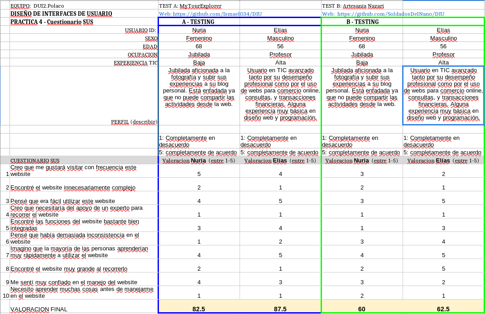

# DIU - Practica 4, entregables

## Usuarios ficticios + Rol Play

Para la realización del role play se han simulado 4 tipos de usuarios de manera aleatoria usando como referencia unos dados que nos indican tipo de usuario, actividad del usuario y emoción del usuario

Se han obtenido las siguientes personas:
- **Persona 1, Prototipo A (4,1,6)**: Raquel es una persona discapacitada que tiene problemas de movilidad y necesita desplazarse en silla de ruedas. Trabaja remotamente como desarolladora desde casa con su portatil. Raquel necesita una plataforma que indique claramente si puede participar en las actividades a causa de su discapacidad. 
- **Persona 2, Prototipo A (5,4,3)**: Pedro es un empresario de mediana edad con poco tiempo. Pedro necesita una plataforma fácil de usar que le permita reservar actividades con solo un par de clicks.
- **Persona 3, Prototipo B (6,5,1)**: Nuria es una mujer jubilada de avanzada edad que le gusta fotografiar cualquier cosa que le pueda parecer interesante cuando viaja. Después, crea publicaciones con las fotos en su blog. Nuria necesita una plataforma que le permita compartir sus expetiencias de manera sencilla para después subirlas a su blog.
- **Persona 4, Prototipo B (1,6,4)**: Ramón es un estudiante. Es una persona tranquila. Cuando tiene tiene tiempo libre hace senderismo ya que es una actividad que le relaja. Ramón necesita una plataforma simple, sin opciones innecesarias.  

| Usuario  | Sexo    | Edad | Ocupación  | Experiencia en internet | Plataforma                         | Perfil cubierto                                                                                | Test | SUS |
|---------|-----------|------|------------|-------------------------|------------------------------------|------------------------------------------------------------------------------------------------|------|----------------|
| Raquel | Femenino | 24   | Desarolladora   | Alta                    | macOS, Linux, Android | Persona discapacitada con problemas de movilidad. Está triste porque no encuentra actividades que se adapten a su discapcidad          | A    |       77.5         |
| Pedro | Masculino  | 43   | Empresario   | Baja                    | Android                       | Empresario de mediana edad con poco tiempo. Está feliz porque ha podido encontrar toda la información de las actividades de manera rápida | A    |       62.5         |
| Nuria | Femenino | 68   | Jubilada | Baja                    | Windows, Android                   | Jubilada aficionada a la fotografía y subir sus experiencias a su blog personal. Está enfadada ya que no puede compartir las actividades desde la web. | B    |       60         |
| Ramón | Masculino  | 19   | Estudiante | Media                    | Windows, iOS                      | Estudiante joven aficionado al senderismo. Está impresionado por la simplicidad de la web y por lo claros que están todos los links y botones. | B    |      75          |

## Cuestionario SUS + Conclusiones A/B test

La aplicación para el caso B ha obtenido una puntuación de 60 para Nuria y 75 para Ramón
respectivamente. La valoración según el cuestionario SUS sería “Marginal D” para la puntuación
de 60 y “Aceptable tipo B” para la puntuación de 75.

La diferencia de puntuación se debe sobretodo a la diferencia de edad y experiencia en
internet. Mientras que Ramón es un chico joven que ha crecido junto a las tecnologías, Nuria no
tiene las misma facilidades, por lo que cualquier error de diseño le afecta más.

## Usability Report (caso B)

[Usability Report PDF](P4_UsabReport_DIU3_SoldadosDelNano_doneby_DIU2_Polaco.pdf)