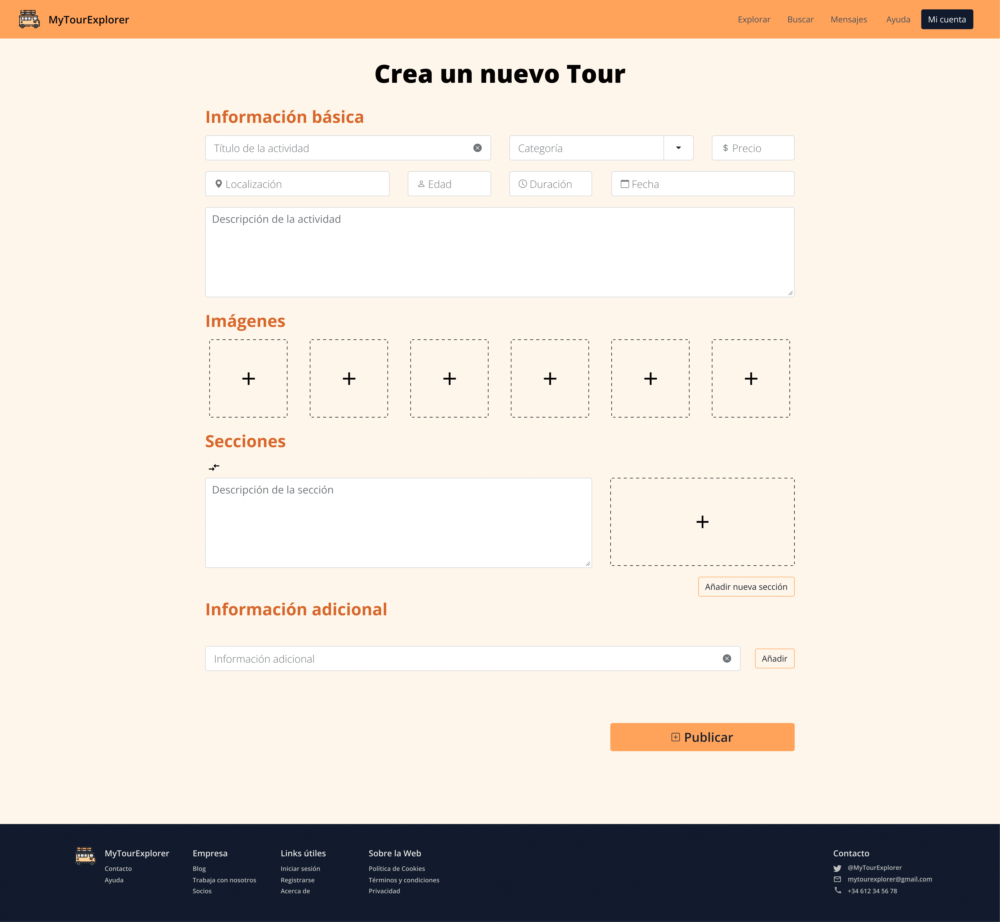
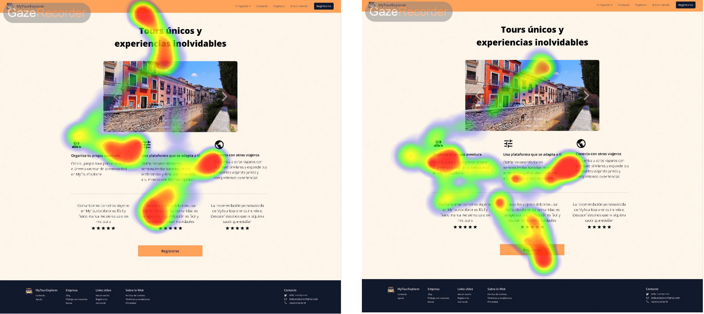
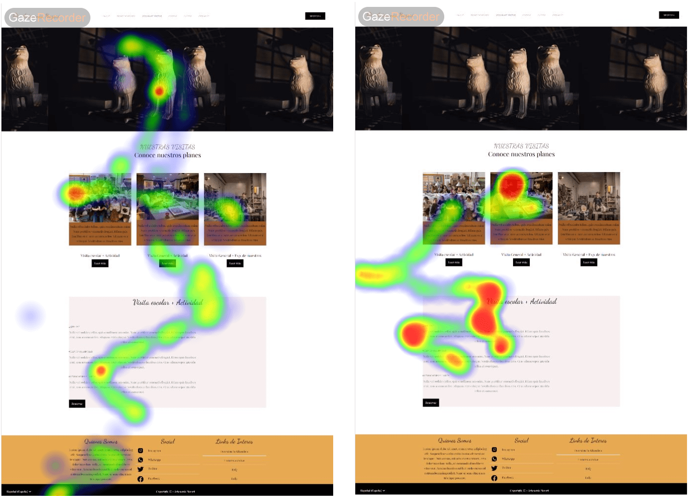

## Practica 5: Eye Tracking 

### Diseño del experimento

Se va a utilizar la aplicación [Gaze Recorder](https://gazerecorder.com/) para analizar la usabilidad de los prototipos A ([MyTourExplorer](https://github.com/Ismael034/DIU)) y B ([Artesanía Nazarí](https://github.com/SoldadosDelNano/DIU))

Para ello se han seleccionados dos usuarios. Cada uno de ellos va a evaluar con la aplicación la usabilidad de secciones específicas de ambos prototipos. Las tareas a supervisar son:

#### MyTourExplorer

**Tarea 1**: 
En esta tarea es del tipo de exploración de comprobar si el usuario puede identificar de manera rápida los elementos importantes de la página como el botón de registro o las características principales de la web.

**Tarea 2**: 
En esta tarea es del tipo de exploración de comprobar si el usuario sigue el recorrido de elementos propuesto: Título,  descripcion, reserva, infromación del tour, información, itinerario, comentarios.

**Tarea 3**: 
En esta tarea es del tipo supervisada. Al usuario se le va a pedir que identifique dónde cree que puede subir imágenes la plataforma o añadir elementos de información adicional.

---

#### Artesanía nazarí

**Tarea 1**: 
En esta tarea es del tipo supervisada. Al usuario se le va a pedir que identifique dónde cree que puede obtener mas información sobre aprender a fabricar cerámica.

**Tarea 2**: 
En esta tarea es del tipo supervisada. Al usuario se le va a pedir que identifique los pasos para registrarse en una actividad

**Tarea 3**: 
En esta tarea es del tipo de exploración. Se le va a preguntar el usuario que dirija su miraba a la parte de la página que más le llame la atención. Es decir, lo primero que miraría al abrir la página

### Recabado de usuarios

Para la realización de esta tarea se escogido a dos usuarios con distintas experiencias en ambas aplicaciones. Se les ha pedido que realicen las acciones previamente mencionadas. Cuando terminen, se obtendrá un mapa de calor con el que se va a poder indentificar posibles de diseño. Los usuarios escogidos han sido:

- Ismael: Usuaro avanzado. Ha tenido experiencia con ambas interfaces previamente
- Elías: Usuario en TIC avanzado tanto por su desempeño profesional como por el uso de webs para comercio online, consultas, y transacciones financieras. Es su primera experiencia en la aplicación. 

### Análisis de datos

Los resultado para cada una de las pantallas serían los siguientes:

#### MyTourExplorer

**Tarea 1**: 

Ambos usuario siguen un patron de movimiento de ojos similar. Estos empiezan desde la parte superior donde se encuentr el título, miran la imagen y proceden a mirar las tres características que se muestran en la aplicación y, por último, el botón de registro. Sin embargo, los usuarios no han prestado mucha atención a las opiniones de otros usuarios de la plataforma.
 

**Tarea 2**: 

En esta tarea se le pide al usuario identificar los bloques para inclui imágenes y añadir información adicional. En ambos casos se ha tenido que analizar la página entera. En el primer caso se puede observar que la identificación de estos elementos ha sido más clara, sin emabargo, el 2 abarca un mayor área por lo que el usuario ha tenido que buscar más en la página.

**Tarea 3**: 

En esta tarea se puede observar un patrón muy similar de zig zag- El usuario comienza mirando al título superior derecha , mira el botón de reserva y a partir de ahí observa cada una de las secciones hasta llegar al resúmen del tour (Información e Itinerario). Podemos observar que la sección de comentarios no es de gran interés para el usuario.

#### Artesanía nazarí

**Tarea 1**: 

Podemos observar que ambos usuarios han seguido un patrón de ohos similar. Ambos usuarios han tenido que observar la página entera de arriba a abajo para encontrar el apartado de "Aprende" pero lo han conseguido sin ningún tipo de complicaciones.

**Tarea 2**: 

En esta tarea se pedía a los usuarios seguir los pasos para completar el formulario. Ambos han completado la tarea de manera correcta en orden de arriba a abajo.

**Tarea 3**: 

En esta tarea se le pedía al usuario centrar la mirada en el lugar que más le llamase la atención. Se puede observar que los tres elementos centrales de actividades destacan, al igual que las visitas escolares.

### RESUMEN 

Al analizar los mapas de calor de ambas aplicaciones podemos llegar a la conclusión de que no hay diferencias significativas entre ambos usuarios. Podemos destacar la rapidez en cuanto al escaneo de las páginas, mientras que el primero usuario se detiene menos en cada apartado y abarca un área mayor, el segundo se detiene con más frecuencia en cada elemento de la página lo que puede ocasionar que no le dé tiempo a poder mirarla en el tiempo dado.